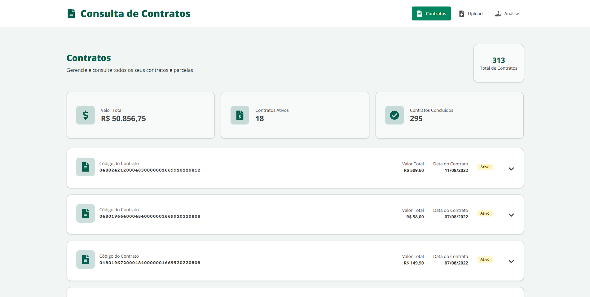
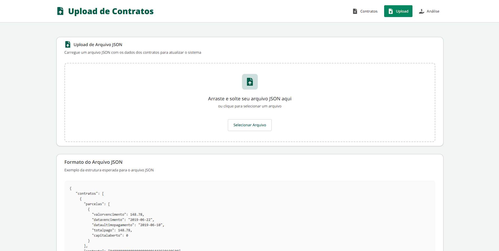
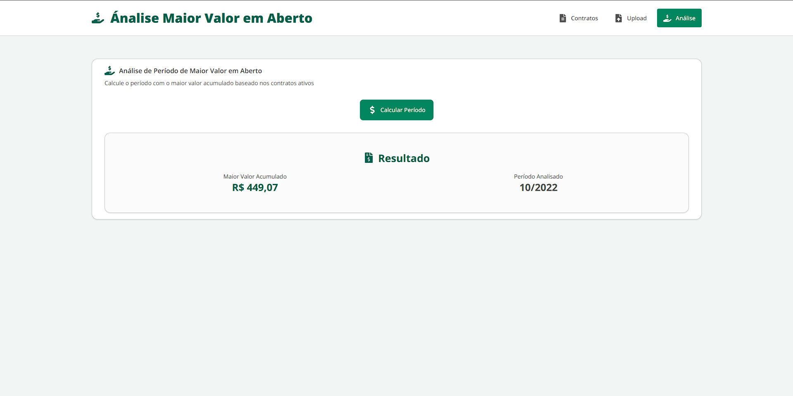

# 📖 Frontend de Histórico de Parcelas

## 🛠️ Stack Tecnológica

* **[React](https://react.dev/)** — biblioteca para construção de interfaces
* **[Vite](https://vitejs.dev/)** — bundler rápido para desenvolvimento
* **TypeScript** — tipagem estática para maior confiabilidade
* **[TailwindCSS](https://tailwindcss.com/)** — estilização rápida e responsiva
* **[shadcn/ui](https://ui.shadcn.com/)** — componentes reutilizáveis
* Integração com API backend (Fastify + SQLite + Knex)

***

## 🚀 Funcionalidades Principais

* **Listagem de contratos e parcelas** em uma tela dedicada
* **Upload de JSON** de contratos via campo de upload "draggable"
* **Envio dos dados** para o backend via requisições HTTP
* **Tela de análise**: permite solicitar o cálculo do maior valor em aberto, retornado pelo backend

***

## 📂 Estrutura de Pastas

```
src/
 ├── components/        # Componentes reutilizáveis (botões, cards, tabelas, etc.)
 ├── pages/             # Páginas principais (Listagem, Upload, Análise)
 ├── providers/         # Providers de dados consumindo a API
 ├── services/          # Configuração de chamadas HTTP (axios)
 ├── types/             # Definições TypeScript (ex: Contrato, Parcela)
 ├── app.tsx            # Chamada do router e provider
 ├── layout-main.tsx    # Rotas principais do app
 └── main.tsx           # Entrada do React
```

***

## 📌 Páginas

### 🔹 Listagem de Contratos

* Exibe contratos e suas parcelas em formato de cards agrupadores, onde ao abrir um dos cards é feito uma requisição para a API retornar as parcelas do contrato em questão para então exibir em uma tabela.
* Consome o endpoint **GET** **`/contratos`**.
* Consome o endpoint **GET** **`/contratos/parcelas/:contratoId`**.



### 🔹 Adicionar Contratos via JSON

* Tela com campo "drag & drop" para upload de arquivos JSON.
* Faz parse/validação do JSON e envia para o endpoint **POST** **`/contratos`**.



### 🔹 Análise de Maior Valor em Aberto

* Botão para solicitar ao backend (endpoint **POST** **`/maiorValorAberto`**) a análise do maior valor em aberto.
* Exibe o resultado em dois cards separados contendo o `mes_ano` e `total_aberto`:



***

## 🧪 Boas Práticas de Desenvolvimento

* Separar componentes em **UI** e **lógica de negócio**
* Utilizar **context customizado** para chamadas à API
* Tipar todas as interfaces com **TypeScript**
* Usar **ESLint + Prettier** para manter o código padronizado
* Utilizar a referência do [design system](https://zeroheight.com/050afef2f/p/85a1b8-magic) na hora da montagem e estilização de componentes

***

## ▶️ Como rodar o projeto

### 1. Instalar dependências

```Shell
npm install
```

### 2. Rodar em desenvolvimento

```Shell
npm run dev
```

### 3. Build para produção

```Shell
npm run build
```

***

## 📡 Integração com o Backend

* A API backend deve estar rodando em `http://localhost:3333` (ajustável via `.env`).
* Exemplo de `.env` no frontend:

```
VITE_PORT_BACKEND=3333
```

No código React:

```TypeScript
const api = axios.create({
  baseURL: `http://localhost:${import.meta.env.VITE_PORT_BACKEND}/`,
})
```

***

📌 Essa documentação serve como **guia inicial** para entender a estrutura e o funcionamento do frontend.
